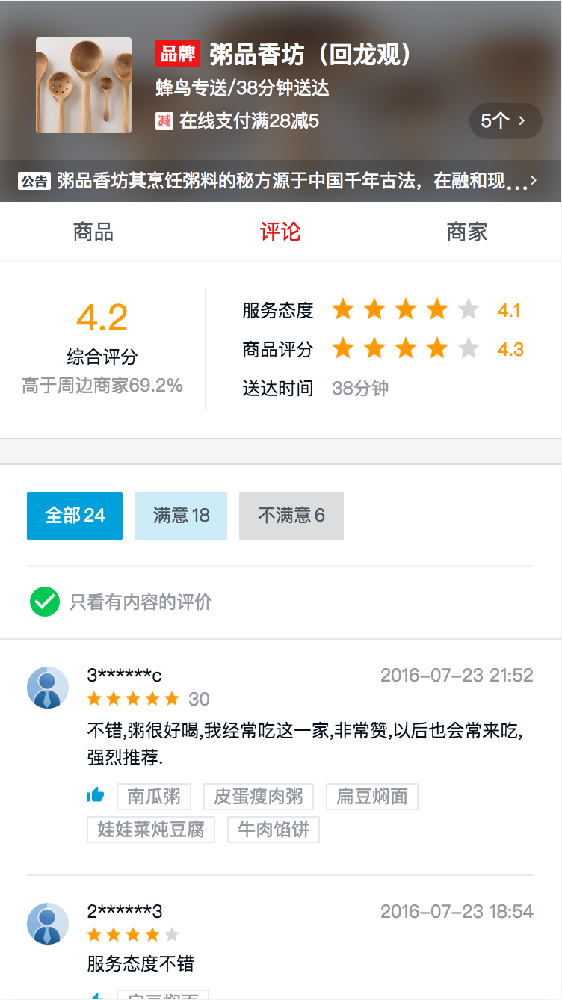

饿了么点餐系统

**效果截图：**

&nbsp;  &nbsp; &nbsp; &nbsp;&nbsp; &nbsp; &nbsp;&nbsp;&nbsp; &nbsp;&nbsp;&nbsp;  &nbsp;  &nbsp; &nbsp; &nbsp;&nbsp;  &nbsp; 

**技术要点：**

vue2.0、vuex、vue-router、axios、webpack、eslint、better-scroll

**功能与组件：**

 购物车
 购买物品小球飞入动画
 评价star组件
 商品添加、删除组件
 优惠图标组件
 目录、列表联动滚动
 评论的是否满意和内容筛选
 商品列表页面
 店铺评价页面
 商家介绍页面
 优惠活动页面
 商品详情页面
